### 你好 👋, 我是[kKsk03](https://github.com/kKsk03) 👨‍💻

还在学习呢......

    
    

### 🛠️ 使用的语言和工具：

### Blog

<a href="https://kksk03.fun/" target="_blank">kKsk's Blog</a>

## Organization's Website

<a href="https://xenon-rs.tech/" target="_blank">XRS Website</a>

<a href="https://racespeedtime.github.io/docs/" target="_blank">Race Speed Time</a>
